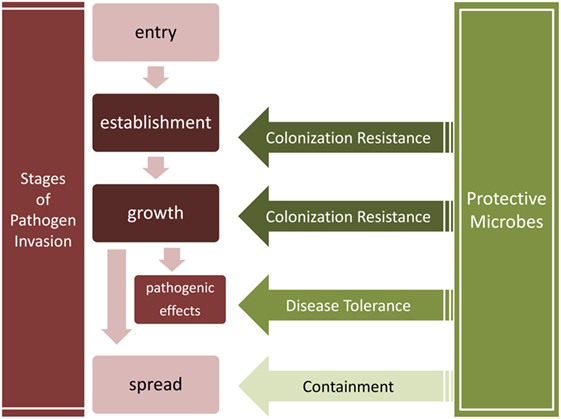

**Abstract**
  

 
Resident microbiota do not just shape host immunity, they can also contribute to host protection against pathogens and infectious diseases. Previous reviews of the protective roles of the microbiota have focused exclusively on colonization resistance localized within a microenvironment. This review shows that the protection against pathogens also involves the mitigation of pathogenic impact without eliminating the pathogens (i.e., “disease tolerance”) and the containment of microorganisms to prevent pathogenic spread. Protective microorganisms can have an impact beyond their niche, interfering with the entry, establishment, growth, and spread of pathogenic microorganisms. More fundamentally, we propose a series of conceptual clarifications in support of the idea of a “co-immunity”, where an organism is protected by both its own immune system and components of its microbiota.

  

**Links**
- [Paper](https://www.frontiersin.org/article/10.3389/fimmu.2017.01678)
- [PDF](https://www.frontiersin.org/articles/10.3389/fimmu.2017.01678/pdf)

**Images**
These are the images I drew for the paper. 

